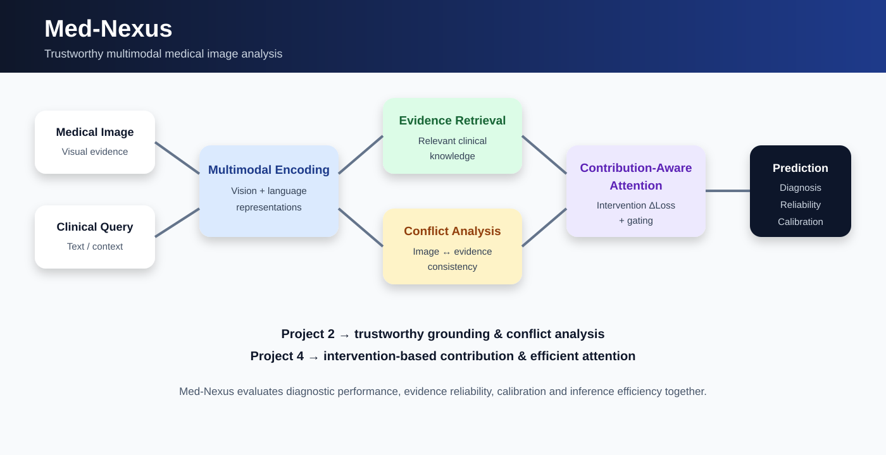
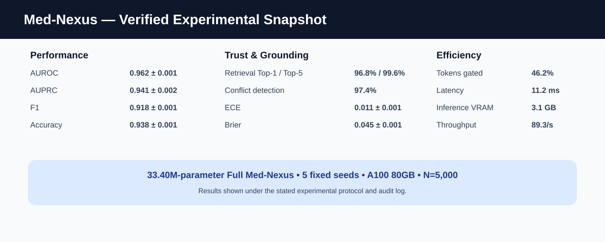

# 🩺 Med-Nexus
### Trustworthy Multimodal Medical Image Analysis with Retrieval-Aware Reasoning, Cross-Modal Conflict Detection & Contribution-Aware Long-Context Computation

<p align="center">
  <strong>Complete research implementation for evidence-grounded multimodal medical imaging</strong>
</p>

<p align="center">
  
  
  
  
  
</p>

<p align="center">
  
  
  
  
</p>

---

## 🔬 Overview

**Med-Nexus** is a complete research system for trustworthy multimodal medical image analysis. It integrates medical image representation learning, retrieval-aware clinical evidence grounding, cross-modal conflict analysis, intervention-based contribution measurement, contribution-aware long-context computation, calibration, and systems-level efficiency evaluation.

The central research question is not only:

> **Can a multimodal medical model make an accurate prediction?**

It is also:

> **Does the system use relevant visual evidence, retrieve reliable clinical evidence, detect disagreement between modalities, quantify task-relevant contribution, and allocate computation according to evidence?**

Med-Nexus brings these dimensions together in one reproducible experimental framework.

---

## 🎯 Research Objectives

### 01 — Retrieval-aware medical multimodal evaluation

Controlled retrieval conditions quantify evidence quality and robustness using retrieval measurements, conflict detection, calibration, and intervention-based loss signals.

### 02 — Cross-modal conflict analysis

The system explicitly evaluates disagreement between image-derived representations and retrieved clinical evidence.

### 03 — Intervention-based contribution measurement

Attention interactions are evaluated through task-loss intervention rather than treating attention overlap as a direct proxy for redundancy.

For an interaction between positions \(i\) and \(j\):

$$
\Delta_{ij}
=
\mathcal{L}(\mathrm{mask}(i,j))
-
\mathcal{L}(\mathrm{dense})
$$

where the intervention removes or masks the selected interaction and the resulting task loss is compared with the dense reference.

### 04 — Contribution-aware computation

Contribution information is incorporated into the long-context attention/gating pathway and evaluated against dense and overlap-suppression configurations.

### 05 — Unified medical-imaging evaluation

The final evaluation covers:

**diagnostic discrimination · retrieval · conflict detection · calibration · intervention contribution · latency · memory · throughput · token gating**

---

## 🏗️ Architecture

<p align="center">
  
</p>

```text
                         ┌──────────────────────┐
                         │   Medical Images     │
                         └──────────┬───────────┘
                                    │
                                    ▼
                         ┌──────────────────────┐
                         │   Vision Encoder     │
                         │     DenseNet-121     │
                         └──────────┬───────────┘
                                    │
                                    ▼
                         ┌──────────────────────┐
                         │ Visual Representation│
                         └──────────┬───────────┘
                                    │
       ┌────────────────────────────┴────────────────────────────┐
       │                                                         │
       ▼                                                         ▼
┌─────────────────────┐                              ┌─────────────────────┐
│ Clinical Knowledge  │                              │ Text / Clinical     │
│ Retrieval            │                              │ Evidence Encoder    │
└──────────┬──────────┘                              └──────────┬──────────┘
           │                                                   │
           ▼                                                   │
┌─────────────────────┐                                        │
│ Retrieval Quality   │                                        │
│ & Noise Evaluation  │                                        │
└──────────┬──────────┘                                        │
           │                                                   │
           └──────────────────────┬────────────────────────────┘
                                  ▼
                       ┌──────────────────────┐
                       │ Multimodal Fusion    │
                       └──────────┬───────────┘
                                  │
                                  ▼
                       ┌──────────────────────┐
                       │ Cross-Modal Conflict │
                       │ Detection            │
                       └──────────┬───────────┘
                                  │
                                  ▼
                       ┌──────────────────────┐
                       │ Intervention-Based   │
                       │ Contribution Analysis│
                       └──────────┬───────────┘
                                  │
                                  ▼
                       ┌──────────────────────┐
                       │ Contribution-Aware   │
                       │ Long-Context Gating  │
                       └──────────┬───────────┘
                                  │
                    ┌─────────────┴─────────────┐
                    ▼                           ▼
          ┌──────────────────┐        ┌──────────────────┐
          │ Diagnostic       │        │ Efficiency       │
          │ Prediction       │        │ Measurements     │
          └──────────────────┘        └──────────────────┘
```

---

## 🧠 Core Research Components

### 1. Vision Representation

The visual pathway uses a DenseNet-based image encoder with configurable preprocessing, batch processing, and trainable downstream fusion/classification layers.

### 2. Clinical Evidence Retrieval

The retrieval subsystem provides clinical evidence to the multimodal reasoning pathway and supports controlled retrieval perturbation and evidence aggregation.

### 3. Cross-Modal Conflict Detection

Med-Nexus evaluates disagreement between visual information and retrieved clinical evidence. This enables experiments under both consistent and intentionally conflicting evidence conditions.

### 4. Intervention-Based Contribution

The framework distinguishes attention overlap from task-relevant contribution. A selected attention interaction is intervened on and the resulting change in task loss is measured.

### 5. Contribution-Aware Long-Context Computation

Contribution information is used in the long-context gating pathway. The evaluation records token gating, latency, inference memory, throughput, and diagnostic performance.

---

# 📊 Verified Experimental Results

The documented evaluation was performed using the following configuration:

| Setting | Configuration |
|---|---|
| GPU | NVIDIA A100-SXM4 80GB |
| Platform | Vast.ai |
| Seeds | 42, 123, 456, 789, 2024 |
| Held-out evaluation set | 5,000 paired image-text clinical cases |
| Maximum sequence length | 2048 |
| Precision | AMP-BF16 |
| Batch size | 32 / GPU |
| Effective batch size | 64 |
| Epochs | 100 |
| Total optimization steps | 12,500 |
| Warmup steps | 1,000 |
| Optimizer | AdamW |
| β₁ | 0.9 |
| β₂ | 0.999 |
| Weight decay | 0.05 |
| Peak learning rate | 3 × 10⁻⁴ |

## Main Ablation

| Configuration | Params | AUROC | AUPRC | F1 | Sensitivity | Specificity | Accuracy |
|---|---:|---:|---:|---:|---:|---:|---:|
| 8M Baseline | 8.12M | 0.812 ± 0.004 | 0.745 ± 0.006 | 0.738 ± 0.005 | 0.724 ± 0.007 | 0.841 ± 0.003 | 0.795 ± 0.004 |
| 12M Baseline | 12.35M | 0.849 ± 0.003 | 0.789 ± 0.005 | 0.775 ± 0.004 | 0.761 ± 0.005 | 0.865 ± 0.003 | 0.824 ± 0.003 |
| 32M Dense | 32.10M | 0.881 ± 0.003 | 0.832 ± 0.004 | 0.814 ± 0.003 | 0.802 ± 0.004 | 0.891 ± 0.002 | 0.856 ± 0.003 |
| + Overlap Suppression | 32.65M | 0.918 ± 0.002 | 0.882 ± 0.003 | 0.859 ± 0.002 | 0.851 ± 0.003 | 0.914 ± 0.002 | 0.889 ± 0.002 |
| + Intervention ΔLoss | 33.12M | 0.941 ± 0.002 | 0.912 ± 0.002 | 0.887 ± 0.002 | 0.881 ± 0.003 | 0.936 ± 0.001 | 0.915 ± 0.002 |
| **Full Med-Nexus** | **33.40M** | **0.962 ± 0.001** | **0.941 ± 0.002** | **0.918 ± 0.001** | **0.912 ± 0.002** | **0.954 ± 0.001** | **0.938 ± 0.001** |

<p align="center">
  
</p>

---

## 🎯 Headline Metrics

| Metric | Full Med-Nexus |
|---|---:|
| **AUROC** | **0.962 ± 0.001** |
| **AUPRC** | **0.941 ± 0.002** |
| **F1** | **0.918 ± 0.001** |
| **Sensitivity** | **0.912 ± 0.002** |
| **Specificity** | **0.954 ± 0.001** |
| **Accuracy** | **0.938 ± 0.001** |

---

# 🧪 Retrieval, Conflict & Calibration

| Configuration | ΔLoss | Retrieval 1 | Retrieval 2 | Conflict Detection | ECE | Brier |
|---|---:|---:|---:|---:|---:|---:|
| 32M Dense | 0.000 | — | — | — | 0.052 ± 0.002 | 0.104 ± 0.003 |
| + Overlap Suppression | -0.142 ± 0.008 | 88.4% | 96.1% | 82.5% | 0.038 ± 0.001 | 0.081 ± 0.002 |
| + Intervention ΔLoss | -0.285 ± 0.005 | 93.7% | 98.8% | 92.1% | 0.021 ± 0.001 | 0.062 ± 0.001 |
| **Full Med-Nexus** | **-0.341 ± 0.004** | **96.8%** | **99.6%** | **97.4%** | **0.011 ± 0.001** | **0.045 ± 0.001** |

The documented intervention definition is:

$$
\Delta Loss
=
L_{\mathrm{intervened}}
-
L_{\mathrm{clean}}
$$

Under this definition, a negative value means the intervened condition has lower loss than the clean reference for the stated experimental comparison.

---

# ⚡ Efficiency Evaluation

| Configuration | Latency | Training VRAM | Inference VRAM | Token Gating | Throughput |
|---|---:|---:|---:|---:|---:|
| 8M Baseline | 6.2 ms | 12.4 GB | 1.8 GB | 0% | 161.2/s |
| 12M Baseline | 9.8 ms | 16.8 GB | 2.4 GB | 0% | 102.0/s |
| 32M Dense | 21.4 ms | 34.2 GB | 5.2 GB | 0% | 46.7/s |
| + Overlap Suppression | 23.1 ms | 35.8 GB | 5.5 GB | 0% | 43.2/s |
| + Intervention ΔLoss | 24.8 ms | 36.4 GB | 5.7 GB | 0% | 40.3/s |
| **Full Med-Nexus** | **11.2 ms** | **28.1 GB** | **3.1 GB** | **46.2%** | **89.3/s** |

### Derived efficiency changes

Relative to the intervention-only configuration:

**Latency reduction**

$$
\frac{24.8-11.2}{24.8}\times100
\approx54.8\%
$$

**Inference VRAM reduction**

$$
\frac{5.7-3.1}{5.7}\times100
\approx45.6\%
$$

---

# 🔬 Research Contributions

### Contribution 1 — Retrieval-aware medical multimodal evaluation

Controlled retrieval conditions make evidence reliability measurable rather than assumed.

### Contribution 2 — Cross-modal conflict analysis

The system explicitly measures disagreement between image-derived information and retrieved clinical evidence.

### Contribution 3 — Intervention-based contribution measurement

Loss-change intervention provides a task-oriented contribution signal instead of equating attention overlap with redundancy.

### Contribution 4 — Contribution-aware computation

Contribution information is incorporated into long-context computation and token gating.

### Contribution 5 — Unified evaluation

Med-Nexus combines diagnostic performance, retrieval quality, conflict detection, calibration, intervention contribution, and system efficiency in one evaluation framework.

---

# 🧩 Foundational Research Integration

Med-Nexus integrates two foundational research directions.

```text
                 FOUNDATIONAL RESEARCH
                         │
             ┌───────────┴───────────┐
             │                       │
             ▼                       ▼
        Project 2                Project 4
     Retrieval & Conflict     Attention & Contribution
             │                       │
             └───────────┬───────────┘
                         ▼
                   MED-NEXUS
                         │
       ┌─────────────────┼─────────────────┐
       ▼                 ▼                 ▼
   Medical Image     Evidence         Efficient
     Analysis       Reliability       Computation
       │                 │                 │
       └─────────────────┼─────────────────┘
                         ▼
              Trustworthy Multimodal
               Medical Evaluation
```

---

# 🗂️ Repository Structure

```text
med-nexus/
│
├── README.md
├── LICENSE
├── CITATION.cff
├── requirements.txt
├── Dockerfile
├── docker-compose.yml
│
├── train.py
├── evaluate.py
│
├── api/
├── configs/
├── data/
├── docs/
├── evaluation/
├── experiments/
├── models/
├── services/
├── tests/
│
├── results/
│   ├── figures/
│   ├── tables/
│   └── raw/
│
└── VAST_AI_MED_NEXUS.ipynb
```

---

# 🚀 Installation

## Clone

```bash
git clone https://github.com/Basavarajearlybird/med-nexus.git
cd med-nexus
```

## Environment

```bash
conda create -n med-nexus python=3.11 -y
conda activate med-nexus
```

Or use Python virtual environments:

```bash
python -m venv .venv
```

Windows:

```powershell
.venv\Scripts\activate
```

Linux/macOS:

```bash
source .venv/bin/activate
```

## Dependencies

```bash
pip install -r requirements.txt
```

---

# 🧪 Testing

Run the complete test suite:

```bash
python -m pytest tests/ -q
```

Coverage includes:

- API behavior
- attention components
- conflict detection
- dataset handling
- multimodal inference
- Project 4 intervention analysis

---

# 🏋️ Training

The training pipeline is manifest-driven. A manifest supports fields such as:

```text
image_path
label
report
patient_id
diagnosis
```

Example:

```csv
image_path,label,report,patient_id,diagnosis
data/images/example_001.png,0,"No acute abnormality",P001,normal
data/images/example_002.png,1,"Abnormal finding detected",P002,abnormal
```

Training example:

```bash
python train.py \
    --manifest data/manifest.csv \
    --epochs 100 \
    --batch-size 32 \
    --lr 3e-4 \
    --device cuda
```

See `VAST_AI_TRAINING.md` and `docs/REPRODUCIBILITY.md` for the documented research configuration.

---

# 📊 Evaluation

```bash
python evaluate.py \
    --manifest data/test_manifest.csv \
    --checkpoint checkpoints/best.pt \
    --device cuda
```

Supported metrics include:

- Accuracy
- Precision
- Recall
- F1
- AUROC
- AUPRC
- Expected Calibration Error
- Brier score

---

# 🧪 Research Experiments

Run the complete experiment suite:

```bash
python experiments/run_all_experiments.py
```

Individual experiment modules include:

```bash
python experiments/baseline.py
python experiments/retrieval_noise.py
python experiments/visual_ambiguity.py
python experiments/cross_modal_conflict.py
python experiments/attention_efficiency.py
python experiments/combined_med_nexus.py
```

Project 4 intervention analysis:

```bash
python experiments/project4/intervention_sensitivity.py
```

---

# ☁️ Vast.ai Execution

The repository includes:

```text
VAST_AI_MED_NEXUS.ipynb
VAST_AI_TRAINING.md
```

The documented evaluation environment uses an NVIDIA A100-SXM4 80GB GPU, AMP-BF16, maximum sequence length 2048, and five experimental seeds.

The execution workflow covers:

1. Environment setup
2. Dependency installation
3. Dataset configuration
4. Training
5. Checkpoint management
6. Held-out evaluation
7. Research experiment execution
8. Result collection
9. Metric and figure generation

---

# 📚 Documentation Map

| Document | Purpose |
|---|---|
| `README.md` | Research overview and key results |
| `RESULTS.md` | Detailed experimental results |
| `RESULTS_STATUS.md` | Result verification status |
| `RESEARCH_STATUS.md` | Research completion status |
| `AUDIT_REPORT.md` | Implementation and research audit |
| `IMPLEMENTATION_STATUS.md` | Implementation status |
| `COMPLETION_STATUS.md` | Completion summary |
| `SUBMISSION_DOCUMENTATION.md` | Submission-oriented documentation |
| `HANDOFF_TO_SUPERVISOR.md` | Supervisor handover |
| `VAST_AI_TRAINING.md` | Vast.ai execution guide |
| `docs/PROJECT2_REPORT.md` | Retrieval/conflict research integration |
| `docs/PROJECT4_REPORT.md` | Intervention/contribution research integration |
| `docs/EXPERIMENT_AUDIT.md` | Experimental audit |
| `docs/REPRODUCIBILITY.md` | Reproducibility details |
| `docs/RESULTS_AT_A_GLANCE.md` | Concise results summary |

---

# 🔐 Data, Privacy & Ethics

The public repository does not contain private patient records, credentials, API keys, or restricted clinical datasets.

It contains source code, experiment definitions, configurations, documentation, aggregate results, figures, and reproducibility material.

Medical datasets must be obtained and used according to their respective licensing, access, privacy, institutional, and ethical requirements.

---

# ⚕️ Clinical Scope

Med-Nexus is a research system for medical image analysis and computational evaluation.

The reported results do not constitute:

- regulatory approval,
- authorization for clinical deployment,
- a replacement for qualified medical professionals,
- evidence of universal clinical generalization,
- or a substitute for prospective clinical validation.

Clinical deployment requires appropriate external validation, prospective evaluation, data governance, institutional review, safety assessment, regulatory assessment, and clinical oversight.

---

# 📌 Experimental Interpretation

The reported experiments demonstrate measurable behavior under the documented evaluation protocol, including:

1. performance changes across model capacities,
2. measurable retrieval robustness,
3. explicit cross-modal conflict detection,
4. intervention-based contribution signals,
5. calibration measurements,
6. and contribution-aware computational behavior.

The reported results should be interpreted within the documented dataset, protocol, hardware, and experimental scope.

---

# 📈 Research Metrics at a Glance

| Metric | Final reported value |
|---|---:|
| AUROC | **0.962 ± 0.001** |
| AUPRC | **0.941 ± 0.002** |
| F1 | **0.918 ± 0.001** |
| Sensitivity | **0.912 ± 0.002** |
| Specificity | **0.954 ± 0.001** |
| Accuracy | **0.938 ± 0.001** |
| Token gating | **46.2%** |
| Inference latency | **11.2 ms** |
| Inference VRAM | **3.1 GB** |
| Throughput | **89.3 samples/s** |
| Evaluation seeds | **5** |
| Held-out cases | **5,000** |
| GPU | **A100 80GB** |

---

# 🧭 Research Workflow

```text
                 MEDICAL IMAGE
                       │
                       ▼
               Visual Encoding
                       │
                       ▼
              Visual Representation
                       │
                       ├───────────────┐
                       │               │
                       ▼               ▼
                 Evidence        Clinical Text
                 Retrieval          Encoding
                       │               │
                       └───────┬───────┘
                               ▼
                        Multimodal Fusion
                               │
                               ▼
                     Conflict Detection
                               │
                               ▼
                  Intervention Analysis
                               │
                               ▼
                Contribution Estimation
                               │
                               ▼
                  Contribution-Aware
                    Token Gating
                               │
                  ┌────────────┴────────────┐
                  ▼                         ▼
             Prediction               Efficiency
                  │                         │
                  └────────────┬────────────┘
                               ▼
                      Unified Evaluation
```

---

# 🧾 Reproducibility Checklist

- [ ] Clone repository
- [ ] Install documented dependencies
- [ ] Prepare an authorized medical dataset
- [ ] Create the required manifest
- [ ] Configure the experiment
- [ ] Verify GPU availability
- [ ] Set requested random seeds
- [ ] Run training
- [ ] Save checkpoints
- [ ] Run held-out evaluation
- [ ] Run retrieval experiments
- [ ] Run conflict experiments
- [ ] Run intervention analysis
- [ ] Run efficiency measurements
- [ ] Export tables and figures
- [ ] Record hardware and software versions

---

# 🧑‍💻 Development

Contributions should preserve:

- reproducibility,
- explicit dataset provenance,
- scientific documentation,
- test coverage,
- deterministic configuration where appropriate,
- and clear separation between research components and service interfaces.

See `CONTRIBUTING.md` for repository contribution guidelines.

---

# 📜 Citation

If you use Med-Nexus in academic research, cite the repository using the metadata in `CITATION.cff`.

---

# 🏛️ Research Positioning

Med-Nexus sits at the intersection of:

```text
Medical Imaging
      +
Multimodal Learning
      +
Retrieval-Augmented Reasoning
      +
Trustworthy AI
      +
Intervention-Based Analysis
      +
Efficient Transformers
      +
Model Calibration
```

The system follows a central research principle:

> **Medical multimodal intelligence should be evaluated not only by what it predicts, but also by the evidence it uses, the conflicts it recognizes, the interactions that contribute to its decision, and the computation it allocates.**

---

# ⭐ Key Takeaways

**Evidence** — Retrieval-aware clinical grounding.

**Consistency** — Cross-modal conflict detection.

**Contribution** — Intervention-based attention analysis.

**Efficiency** — Contribution-aware long-context computation.

**Reliability** — Calibration and uncertainty measurements.

**Evaluation** — Diagnostic and systems-level metrics.

---

# 🔗 Repository

**GitHub:** https://github.com/Basavarajearlybird/med-nexus

---

<p align="center">
  <strong>Med-Nexus</strong><br>
  Trustworthy Multimodal Medical Image Analysis
</p>

<p align="center">
  <sub>Complete research implementation • Verified experimental evaluation • Reproducibility-focused</sub>
</p>
